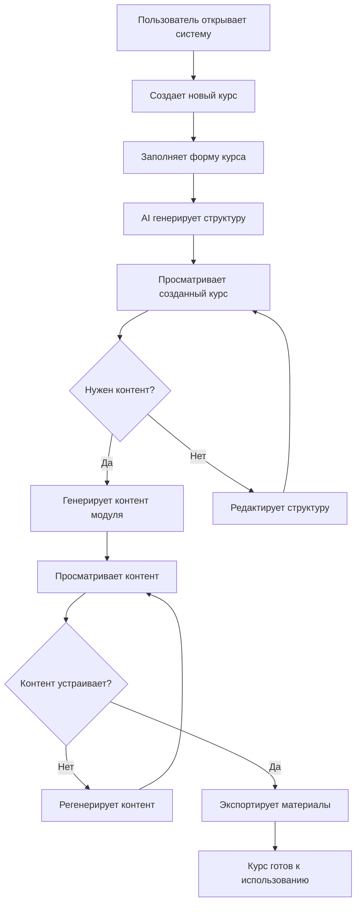

# 🔄 Пользовательский пайплайн AI Course Builder

## 📋 Обзор процесса

Пайплайн описывает полный цикл создания IT-курса от идеи до готового контента с использованием AI.

---

## 🎯 Этапы пайплайна

### 1. 📝 **Создание курса**
```
Пользователь вводит данные → AI генерирует структуру → Курс сохраняется
```

**Что делает пользователь:**
- Открывает страницу "Создать курс"
- Заполняет форму:
  - Название курса
  - Целевая аудитория
  - Продолжительность (часы/недели)
  - Описание целей курса

**Что происходит в системе:**
- Данные отправляются в FastAPI
- AI (GPT-4) анализирует требования
- Генерируется структура курса с модулями и уроками
- Курс сохраняется в базе данных
- Пользователь перенаправляется на страницу курса

---

### 2. 📚 **Просмотр структуры курса**
```
Курс создан → Пользователь видит модули и уроки → Может генерировать контент
```

**Что видит пользователь:**
- Общую информацию о курсе
- Список модулей с названиями и целями
- Уроки внутри каждого модуля
- Кнопки действий для каждого элемента

**Доступные действия:**
- ✏️ Редактировать курс
- 📤 Экспортировать весь курс
- 🎯 Генерировать контент модуля
- 👁️ Просматривать детали

---

### 3. 🎯 **Генерация контента модуля**
```
Выбор модуля → AI создает детальный контент → Контент сохраняется
```

**Что делает пользователь:**
- Нажимает "Генерировать контент" у модуля
- Ждет завершения AI-генерации (30-60 секунд)
- Получает уведомление об успехе

**Что генерирует AI:**
- **Лекции:** Подробные тексты по темам модуля
- **Слайды:** Структурированные презентационные материалы
- **Практические задания:** Упражнения и кейсы
- **Тесты:** Вопросы для проверки знаний

**Результат:**
- Модуль получает статус "Контент готов"
- Появляются кнопки для просмотра и экспорта

---

### 4. 📖 **Просмотр сгенерированного контента**
```
Контент готов → Пользователь изучает материалы → Может корректировать
```

**Что видит пользователь:**
- **Лекции:** Полные тексты с теорией
- **Слайды:** Структурированные презентации
- **План урока:** Пошаговое содержание
- **Материалы:** Дополнительные ресурсы

**Доступные действия:**
- 👁️ Просматривать контент в браузере
- 📤 Экспортировать в различных форматах
- 🔄 Регенерировать контент (если не устраивает)
- ✏️ Редактировать вручную

---

### 5. 🔄 **Регенерация контента (опционально)**
```
Не устраивает контент → Регенерация → Новый вариант
```

**Когда используется:**
- Контент не соответствует ожиданиям
- Нужен другой стиль изложения
- Требуется больше/меньше детализации

**Что делает пользователь:**
- Нажимает "Регенерировать контент"
- Выбирает что именно перегенерировать:
  - Цели модуля
  - План урока
  - Слайды урока
- Ждет завершения процесса

**Результат:**
- Старый контент заменяется новым
- Сохраняется история изменений

---

### 6. 📤 **Экспорт готового контента**
```
Контент готов → Выбор формата → Скачивание файла
```

**Доступные форматы экспорта:**

#### 📄 **Markdown (.md)**
- Чистый текст с разметкой
- Подходит для документации
- Легко редактировать

#### 🌐 **HTML (.html)**
- Готовые веб-страницы
- Красивое форматирование
- Можно открыть в браузере

#### 📊 **PowerPoint (.pptx)**
- Готовые презентации
- Слайды с оформлением
- Подходит для обучения

#### 📋 **JSON (.json)**
- Структурированные данные
- Для интеграции с другими системами
- Программная обработка

**Что экспортируется:**
- **Курс целиком:** Все модули и уроки
- **Отдельный модуль:** Контент одного модуля
- **Отдельный урок:** Материалы одного урока

---

## 🔄 Полный цикл пайплайна



---

## ⏱️ Временные рамки

| **Этап** | **Время выполнения** | **Зависит от** |
|----------|---------------------|----------------|
| Создание курса | 10-30 секунд | Сложности темы |
| Генерация модуля | 30-60 секунд | Объема контента |
| Регенерация | 20-40 секунд | Типа изменений |
| Экспорт | 1-5 секунд | Размера файла |

---

## 🎯 Результаты пайплайна

### ✅ **Что получает пользователь:**
- **Готовый IT-курс** с полной структурой
- **Детальный контент** по всем модулям
- **Презентационные материалы** для обучения
- **Практические задания** и тесты
- **Материалы в разных форматах** для удобства

### 📊 **Качество контента:**
- **Структурированность:** Логичная последовательность тем
- **Актуальность:** Современные технологии и подходы
- **Практичность:** Реальные кейсы и примеры
- **Адаптивность:** Под конкретную аудиторию

---

## 🚀 Преимущества пайплайна

### ⚡ **Скорость**
- Создание курса за минуты вместо дней
- Автоматическая генерация контента
- Мгновенный экспорт в нужном формате

### 🎯 **Качество**
- AI создает профессиональный контент
- Структурированный подход к обучению
- Адаптация под целевую аудиторию

### 🔄 **Гибкость**
- Возможность регенерации контента
- Множество форматов экспорта
- Легкое редактирование и корректировка

### 💰 **Экономия**
- Снижение времени на создание курсов
- Меньше затрат на разработку контента
- Быстрый вывод на рынок

---

## 📝 Заключение

Пайплайн AI Course Builder превращает процесс создания IT-курсов из недельной задачи в процесс, занимающий часы. Пользователь фокусируется на стратегических решениях (цели, аудитория, структура), а AI берет на себя техническую работу по созданию качественного контента.

**Результат:** Профессиональные IT-курсы готовы к использованию за минимальное время.
